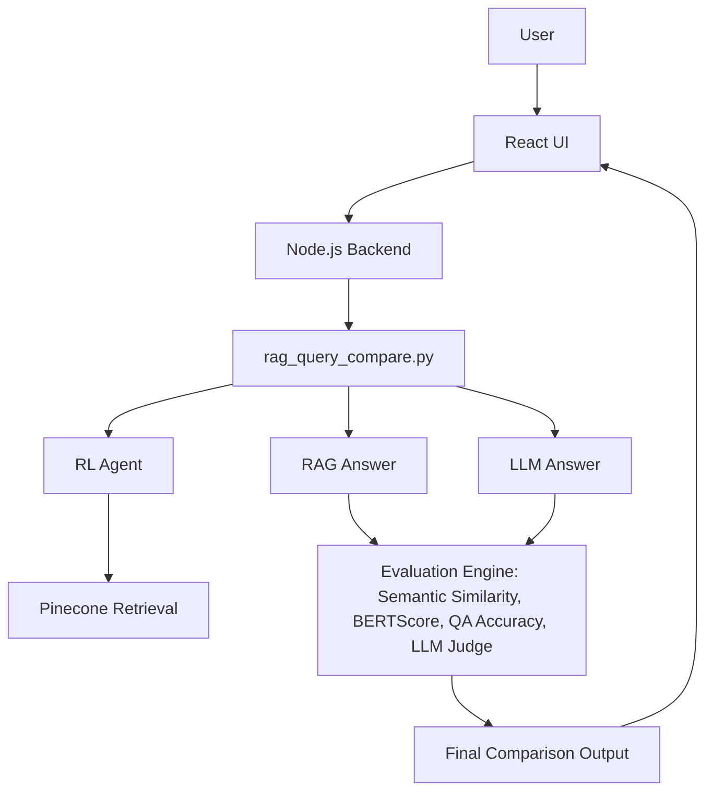

# Project M.A.R.S. (Multi-source Augmented RAG System)

Project M.A.R.S. is an intelligent chatbot application that leverages Retrieval-Augmented Generation (RAG) to provide answers based on dynamically retrieved web content. It goes a step further by comparing the RAG-generated answer with a response from a standard Large Language Model (LLM) and provides a comprehensive evaluation of both.

## How it is better than current LLMs

General-purpose Large Language Models (LLMs) have a vast but static knowledge base. Their information is limited to what they were trained on, and they can sometimes provide outdated or incorrect information (a phenomenon known as "hallucination").

M.A.R.S. overcomes these limitations by implementing a sophisticated RAG (Retrieval-Augmented Generation) pipeline, a comprehensive evaluation system, and **Reinforcement Learning for continuous improvement**:

1.  **Dynamic Information Retrieval (RAG Core):**
    *   When a user submits a query, M.A.R.S. first uses a search tool (Serper API) to find relevant web pages.
    *   These web pages are then scraped for their content, and the extracted text is converted into numerical representations (embeddings).
    *   These embeddings are stored in a vector database (Pinecone), creating a dynamic, up-to-date knowledge base specific to the query.
    *   A powerful LLM (Groq's Llama 3.3) then generates an answer, but critically, it is "augmented" with the retrieved and embedded context from the web. This ensures the answer is grounded in current, external information.

2.  **Direct LLM Response:**
    *   Simultaneously, the same LLM generates an answer to the user's query *without* any external context (i.e., a pure LLM response).

3.  **Comprehensive Evaluation:**
    *   Both the RAG-augmented answer and the pure LLM answer are then subjected to a rigorous, multi-metric evaluation process:
        *   **Semantic Similarity:** Measures how semantically similar the two answers are to each other using Sentence-Transformers.
        *   **BERTScore:** Evaluates the quality of the RAG answer against the LLM answer (or vice-versa) by comparing their contextual embeddings, providing precision, recall, and F1 scores.
        *   **Factual Accuracy (QA-based):** A Question-Answering (QA) model (e.g., RoBERTa-base-squad2) is used to assess if key facts from the original query are present and correctly addressed in each answer.
        *   **Judge Model Comparison:** A powerful LLM acts as an impartial judge, comparing both answers qualitatively, providing a justification, and declaring a "winner" based on overall quality, relevance, and completeness.

4.  **Reinforcement Learning (RL) for Optimization:**
    *   The evaluation metrics are combined into a scalar reward signal.
    *   A basic RL agent learns from these rewards, dynamically adjusting RAG parameters (e.g., the `top_k` value for document retrieval) to continuously improve the accuracy and quality of the RAG-generated answers over time.

This multi-faceted approach ensures that M.A.R.S. not only provides context-specific, up-to-date, and less hallucinatory answers but also offers transparency into the performance differences between RAG and pure LLM approaches, and actively learns to optimize its own performance.

## Flow Diagram



Here is the detailed flow of how the application works:

```
+---------------------+      +----------------------+      +-----------------------------------------------------+
|   User Interface    |      |      Node.js/Express |      |    Python Scripts (RAG Core & Evaluation)           |
|      (React)        |      |        Backend       |      |                                                     |
+---------------------+      +----------------------+      +-----------------------------------------------------+
          |                            |                                               |
          | 1. User submits query      |                                               |
          |    (always triggers        |                                               |
          |    comparison)             |                                               |
          |--------------------------->| 2. Backend receives query                     |
          |                            |    and invokes `rag_query_compare.py`         |
          |                            |---------------------------------------------->| 3. `rag_query_compare.py` starts:
          |                            |                                               |    a. **RL Agent Action:**
          |                            |                                               |       - `rl_agent.py` chooses optimal `top_k` for retrieval.
          |                            |                                               |    b. **Dynamic Data Ingestion:**
          |                            |                                               |       - Uses `searchurl.py` (Serper API) to find relevant URLs.
          |                            |                                               |       - Uses `webscrap.py` to scrape content from found URLs.
          |                            |                                               |       - Embeds scraped content using `SentenceTransformer`.
          |                            |                                               |       - Upserts embeddings to Pinecone vector database.
          |                            |                                               |    c. **RAG Answer Generation:**
          |                            |                                               |       - Retrieves `top_k` relevant documents from Pinecone based on query.
          |                            |                                               |       - Constructs a prompt with retrieved context.
          |                            |                                               |       - Sends prompt to Groq LLM (`llama-3.3-70b-versatile`) for RAG answer.
          |                            |                                               |    d. **Pure LLM Answer Generation:**
          |                            |                                               |       - Sends original query directly to Groq LLM (`llama-3.3-70b-versatile`) for a non-RAG answer.
          |                            |                                               |    e. **Comprehensive Evaluation:**
          |                            |                                               |       - Calls `comprehensive_evaluate.py` with query, RAG answer, and LLM answer.
          |                            |                                               |       - `comprehensive_evaluate.py` calculates:
          |                            |                                               |         - Semantic Similarity (Sentence-Transformers)
          |                            |                                               |         - BERTScore (between RAG and LLM answers)
          |                            |                                               |         - Factual Accuracy (QA model, e.g., RoBERTa-base-squad2)
          |                            |                                               |         - Judge Model Evaluation (Groq LLM for qualitative comparison & winner)
          |                            |                                               |         - Calculates a scalar `rag_reward`.
          |                            |                                               |    f. **RL Agent Learning:**
          |                            |                                               |       - `rl_agent.py` learns from the `rag_reward` to update its policy.
          |                            |                                               |
          |<---------------------------| 4. `rag_query_compare.py` returns a single    |
          |                            |    JSON object containing RAG answer, LLM     |
          |                            |    answer, and comprehensive evaluation.      |
          |                            |                                               |
          | 5. Backend sends this      |                                               |
          |    data to the frontend    |                                               |
          |<---------------------------|                                               |
          | 6. Frontend displays       |                                               |
          |    side-by-side comparison |                                               |
          |    of answers, detailed    |                                               |
          |    evaluation metrics,     |                                               |
          |    and a visual graph.     |                                               |
          |                            |                                               |
```

## Key Features

*   **User Authentication:** Secure user login and registration using JWT.
*   **RAG vs. LLM Comparison:** The core feature that provides a side-by-side comparison of answers from a RAG model and a standard LLM.
*   **Comprehensive Evaluation:** A sophisticated evaluation pipeline that uses multiple metrics to assess the quality of the generated answers.
*   **Reinforcement Learning Integration:** A basic RL agent learns from evaluation rewards to dynamically optimize RAG parameters (e.g., `top_k` for retrieval), aiming to improve accuracy over time.
*   **Visual Comparison:** A graph to visually compare the performance of the two models.
*   **Professional UI/UX:** Redesigned login and signup pages for a modern and professional user experience.
*   **Responsive UI:** A clean and simple chat interface.

## Technologies Used

*   **Frontend:** React, Vite, Axios, Recharts
*   **Backend:** Node.js, Express, Mongoose, JWT
*   **Python:** Sentence-transformers, Pinecone, Groq, BERT-Score, Transformers

## Project Structure

```
.
├── backend
│   ├── db.js
│   ├── docker.yaml
│   ├── index.js
│   ├── middleware
│   │   └── fetchuser.js
│   ├── models
│   │   ├── Score.js
│   │   └── User.js
│   ├── node
│   │   ├── comprehensive_evaluate.py
│   │   ├── embed_and_upload.py
│   │   ├── rag_query.py
│   │   ├── rag_query_compare.py
│   │   ├── reward_memory.json
│   │   ├── scraped_data.json
│   │   ├── searchurl.py
│   │   ├── webscrap.py
│   │   └── rl_agent.py
│   ├── package.json
│   └── routes
│       ├── auth.js
│       └── rag.js
├── public
│   └── vite.svg
├── src
│   ├── assets
│   │   └── react.svg
│   ├── components
│   │   ├── ChatArea.jsx
│   │   ├── ComparisonGraph.jsx
│   │   ├── ComparisonMessage.jsx
│   │   ├── EvaluationDetails.jsx
│   │   ├── Header.jsx
│   │   ├── Message.jsx
│   │   ├── MessageInput.jsx
│   │   ├── Shimmer.jsx
│   │   └── Sidebar.jsx
│   ├── pages
│   │   ├── LoginPage.jsx
│   │   └── SignupPage.jsx
│   ├── App.css
│   ├── App.jsx
│   ├── index.css
│   └── main.jsx
├── .gitignore
├── eslint.config.js
├── index.html
├── package.json
├── README.md
└── vite.config.js
```

## API Endpoints

*   `POST /api/auth/signup`: Create a new user.
*   `POST /api/auth/login`: Login a user.
*   `GET /api/auth/getuser`: Get the logged-in user's data.
*   `POST /api/rag/query`: Get a response from the RAG model (not used in the current UI).
*   `POST /api/rag/compare`: Get a comparison between the RAG and LLM models.

## Python Scripts

*   `rag_query_compare.py`: The main script that orchestrates the comparison pipeline. It takes a user query, generates RAG and LLM answers, and calls the evaluation script. It also interacts with the `rl_agent.py` to choose optimal RAG parameters and learn from the results.
*   `comprehensive_evaluate.py`: Performs a comprehensive evaluation of the two answers using various metrics and calculates a scalar reward for the RAG answer.
*   `rl_agent.py`: Implements a basic Reinforcement Learning agent that learns from past evaluation rewards to dynamically select optimal RAG parameters (e.g., `top_k` for document retrieval).
*   `rag_query.py`: A script for querying the RAG model (not used in the current comparison pipeline).
*   `embed_and_upload.py`: A utility script to embed and upload data to the Pinecone vector database.
*   `searchurl.py`: A utility script to search for URLs based on a query using the Serper API.
*   `webscrap.py`: A utility script to scrape the content of a webpage.

## How to Run the Project

### Recent Updates and Improvements

This project has undergone several significant updates and improvements:

*   **Reinforcement Learning (RL) Integration:** A foundational RL system has been integrated. This includes:
    *   A comprehensive reward function in `comprehensive_evaluate.py` that calculates a scalar reward for RAG answers based on faithfulness, factual accuracy, completeness, clarity, and semantic similarity to the query.
    *   An action space defined by the `top_k` parameter for Pinecone retrieval.
    *   A basic `rl_agent.py` that learns from past rewards to dynamically choose `top_k` values, aiming to optimize RAG performance over time.
*   **UI/UX Enhancements:**
    *   The Login and Signup pages (`LoginPage.jsx`, `SignupPage.jsx`) have been professionally redesigned with a modern, dark-themed, and responsive interface.
*   **Feature Removal:**
    *   The entire chat history feature (frontend pages, backend routes, and database models) has been completely removed to streamline the application.
*   **Bug Fixes and Stability:**
    *   Resolved multiple `NameError` issues in Python scripts (`comprehensive_evaluate.py`) to ensure stable execution.
    *   Implemented user-agent headers in `webscrap.py` to improve web scraping success rates and mitigate 403 Forbidden errors (though some sites may still block access).
    *   Fixed malformed JSON output from `rag_query_compare.py` by ensuring proper flushing of `stdout`, resolving parsing errors in the Node.js backend.
    *   Addressed chat saving validation errors by updating the backend `MessageSchema` and frontend `ChatArea.jsx` to correctly handle comparison messages (though chat saving is now removed with the history feature).

### Prerequisites

*   Node.js
*   Python 3.10+
*   MongoDB

### Backend Setup

1.  **Navigate to the `backend` directory:**
    ```bash
    cd backend
    ```

2.  **Install Node.js dependencies:**
    ```bash
    npm install
    ```

3.  **Install Python dependencies:**
    ```bash
    pip install -r requirements.txt
    ```
    *(Note: You may need to create a `requirements.txt` file first. See the "Python Dependencies" section below.)*

4.  **Create a `.env` file** in the `backend` directory and add the following environment variables:
    ```
    MONGO_URI=<your_mongodb_uri>
    JWT_SECRET=<your_jwt_secret>
    PINECONE_API_KEY=<your_pinecone_api_key>
    GROQ_API_KEY=<your_groq_api_key>
    SERPER_API_KEY=<your_serper_api_key>
    ```

5.  **Start the backend server:**
    ```bash
    node index.js
    ```

### Frontend Setup

1.  **Navigate to the root directory.**

2.  **Install Node.js dependencies:**
    ```bash
    npm install
    ```

3.  **Start the frontend development server:**
    ```bash
    npm run dev
    ```

### Python Dependencies

The Python scripts require the following libraries. You can install them using pip:
```bash
pip install sentence-transformers pinecone-client groq bert-score torch transformers beautifulsoup4 requests python-dotenv
```

You can also create a `requirements.txt` file with the following content and run `pip install -r requirements.txt`:
```
sentence-transformers
pinecone-client
groq
bert-score
torch
transformers
beautifulsoup4
requests
python-dotenv
```


<video 
   src="https://github.com/user-attachments/assets/8c32a062-caed-472c-9424-8311d80fb608">
</video>


